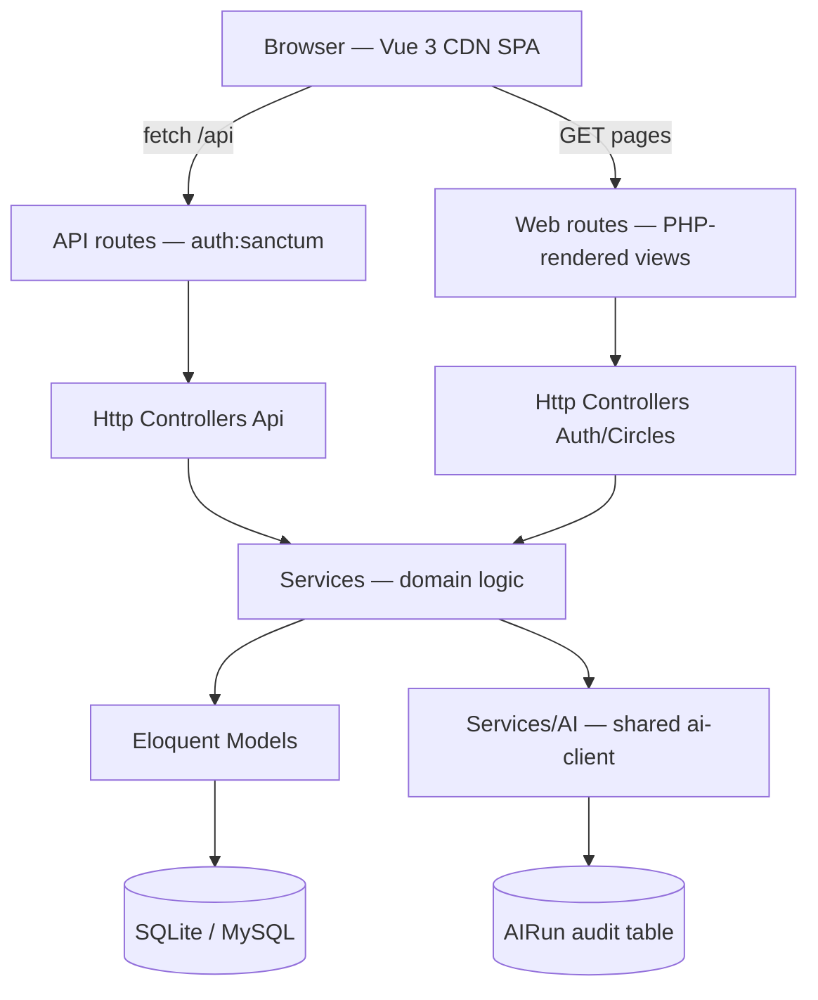

# SIKA Architecture Baseline

> **Phase 0 deliverable.** The Okyema prompt refers to a reference
> application called "SIKA". On this machine SIKA is the repository
> `c:\repos\study-fund`. This document records what was actually found by
> inspecting that repository, running its validation commands, and tracing a
> vertical slice. Nothing here is guessed.

## 1. Detected stack and versions

| Layer | Technology | Version observed |
|-------|-----------|------------------|
| Runtime | PHP | 8.4.22 (composer requires `^8.3`) |
| Framework | Laravel | 11.55.0 (`laravel/framework: ^11.0`) |
| Frontend | Vue 3 (CDN, no build step) | 3.4.38 via jsdelivr |
| Styling | Single hand-written CSS file | `public/css/studyfund.css` |
| Database | SQLite (local) / MySQL (VPS) | `DB_CONNECTION=sqlite` |
| Auth (web) | Laravel session | `SESSION_DRIVER=file` |
| Auth (API) | Laravel Sanctum | `laravel/sanctum: ^4.0` |
| OAuth | Laravel Socialite (Google) | `laravel/socialite: ^5.29` |
| AI client | Shared `courtly/ai-client` package | `@dev`, path `../ai-client` |
| Tests | Pest + Pest Laravel plugin | `pestphp/pest: ^2.34` |
| Style | Laravel Pint | `laravel/pint: ^1.13` |
| E2E | Playwright (fully offline) | `@playwright/test 1.63.0` |
| Queue | Laravel database queue | `QUEUE_CONNECTION=database` |

**Validation run (no source changes):**

- `php artisan about` — boots cleanly (Laravel 11.55.0, PHP 8.4.22).
- `php vendor/bin/pest` — **250 passed (1054 assertions)**.
- `php vendor/bin/pint --test` — reports style differences, almost all of
  which are CRLF→LF `line_ending` because the Windows checkout stores CRLF.
  SIKA is intentionally not modified, so these are left as-is and noted here.

## 2. Repository map

```
study-fund/
├── app/
│   ├── Console/Commands/          # ReleaseCommand, SendDeployEmail, ReceiptScanStatus
│   ├── Enums/                     # string-backed enums (TransactionType, CircleRole, …)
│   ├── Http/Controllers/
│   │   ├── Api/                   # Sanctum JSON API (one controller per aggregate)
│   │   │   ├── Concerns/          # AuthorizesOwnership, AuthorizesCircles
│   │   │   └── Circles/           # circle-scoped controllers
│   │   ├── Auth/                  # web session controllers (login/register/google)
│   │   └── Circles/               # web invite-link controller
│   ├── Models/                    # Eloquent models with belongsToUser()
│   ├── Providers/                 # AppServiceProvider only
│   ├── Services/                  # domain logic, pure + injected
│   │   ├── AI/                    # AIProviderInterface, provider, AIRunLogger, advisors
│   │   └── Circles/               # circle domain services
│   └── Support/                   # Version, CaBundle, GoogleRedirectUri
├── bootstrap/                     # app.php, providers.php, cache/
├── config/                        # circles, database, services, session, studyfund
├── database/                      # migrations (dated), seeders, factories
├── docker/                        # nginx/ + php/ (shared Courtly compose stack)
├── public/                        # index.php, css/, assets/, manifest, sw.js
├── resources/views/               # app.php, login.php, register.php, welcome.php, partials/
├── routes/                        # web.php, api.php, console.php
├── tests/                         # Pest.php, TestCase.php, Feature/, Unit/, e2e/
├── tools/                         # make-icons.mjs
├── composer.json / package.json / phpunit.xml / .env.example
└── deploy.sh                      # VPS deploy: pull, build, recreate, migrate, notify
```

## 3. Architectural layers and dependency direction



- **Dependency direction is one-way:** controllers → services → models →
  database. Models and services never depend on controllers or on the
  framework's HTTP layer beyond Eloquent/facades.
- **Views are PHP-rendered HTML shells**, not Blade templates. The signed-in
  shell (`resources/views/app.php`) is a static HTML page with the Vue app
  written inline; it bootstraps from the API once mounted. Guests get
  `welcome.php`; auth pages are `login.php` / `register.php`.
- **No build step.** Vue comes from a CDN; there is no Vite/Webpack. The only
  cache-busting mechanism is the `?v=` version suffix from
  `config/studyfund.php` → `studyfund.app.version`.

## 4. Request / data flow (vertical slice: record an expense)

1. Vue SPA calls `POST /api/transactions/expense` with the session cookie.
2. `EnsureFrontendRequestsAreStateful` (Sanctum, prepended to the API group)
   turns the cookie session into an authenticated `auth:sanctum` request.
3. `TransactionController::addExpense()` validates inline with
   `$request->validate(...)` (regex for money strings, `Rule::enum` for enums).
4. Money is parsed from string to integer minor units by
   `MoneyMath::majorToMinor()` — never floats.
5. `FinanceService::recordExpense()` performs the ledger write and bucket
   balance update inside the domain service.
6. Errors surface as `{ "message": "…" }` with a 4xx status; success returns
   `{ "data": … }` with 201.
7. Ownership is enforced by scoping queries to `$request->user()` and, for
   model lookups, `AuthorizesOwnership::authorizeModel()`.

## 5. Authentication and authorisation model

- **Web:** Laravel session auth via `Auth\AuthController` (login, register,
  logout, Google OAuth callback). `POST /login` and `/register` are throttled
  `6,1`.
- **API:** Sanctum (`auth:sanctum`) using the same cookie session — the SPA
  talks to `/api` with `SANCTUM_STATEFUL_DOMAINS` listed.
- **Google OAuth:** Socialite. Links an account by email; never overwrites an
  existing password; retries transient network failures once; derives the
  redirect URI carefully via `GoogleRedirectUri` (explicit `GOOGLE_REDIRECT_URI`
  wins; production derives from `APP_URL`, local follows the browsed host).
- **Authorisation is server-side only.** `AuthorizesOwnership` gives a 403 to
  non-owners of per-user resources. `AuthorizesCircles` returns **404** for a
  non-member (never confirming a Circle exists) and **403** for a member
  lacking a specific ability. The SPA hiding a button is a courtesy, not a
  rule.
- **Users:** `User` (Sanctum `HasApiTokens`, `Notifiable`) with a 1:1
  `StudentProfile`; the data model is **multi-user ready**, not hard-coded to
  a single account.

## 6. Persistence approach

- Eloquent models with dated migrations, string-backed enums cast to enum
  classes, `belongsToUser(User): bool` on owned models.
- Money is an integer number of minor units (pence); a pure `MoneyMath` helper
  parses/format/splits with integer-only arithmetic.
- SQLite in-memory for tests (`phpunit.xml`), SQLite file locally, MySQL on
  the VPS (shared Compose stack).
- `QUEUE_CONNECTION=database` with the standard `jobs` migration in place.

## 7. UI / design-system conventions

- Single-file CSS with `:root` design tokens (`--bg`, `--surface`, `--stroke`,
  `--text`, `--accent`, `--radius`, `--shadow`, `--tabbar-height`).
- Mobile-first: `#app` is `max-width: 480px` centred, with a bottom tab bar
  and `env(safe-area-inset-bottom)` handling.
- The theme is set once via `data-theme="light"`; there is no dark theme in
  SIKA (Okyema requires an automatic light/dark system, which is a documented
  deviation).
- Reusable classes: `.card`, `.btn--primary`, `.field`, `.auth-card`,
  `.user-menu`, `.ring-card`, `.appbar`.
- PWA: `manifest.webmanifest` + network-pass-through `sw.js` + `pwa-head.php`
  partial that captures `beforeinstallprompt` early.

## 8. AI integration (Regno AI)

- `AIProviderInterface` extends `Courtly\AiClient\AIProviderInterface`;
  `OpenAiCompatibleProvider` extends the shared class. `AppServiceProvider`
  binds the interface and registers a manual autoloader for machines without
  Composer.
- **Deterministic fallback:** when `AI_ENABLED=false` (the default, and the
  test environment), advisors answer from a hard-coded baseline — so the
  product works with no provider at all.
- **Audit:** `AIRunLogger` writes an `AIRun` row (provider, model, latency,
  status, error) and summarises input to keep it bounded. Logging is
  best-effort and must never break the feature.
- Receipt scanning reads an image in memory and stores **nothing**.

## 9. Testing and deployment

- **Tests:** Pest. `Feature/` mirrors the API surface (one file per controller
  area); `Unit/` holds pure logic (`MoneyMathTest`, `VersionTest`). Tests run
  against SQLite `:memory:` with AI disabled, mail array, queue sync.
- **E2E:** Playwright, fully offline, run on demand (`npm run test:e2e`) — not
  part of a routine browser check.
- **Release:** `php artisan studyfund:release patch|minor|major` bumps
  `config/studyfund.php`, refuses on dirty tree/existing tag, runs the suite,
  commits and tags.
- **Deploy:** `deploy.sh` pulls `master`, rebuilds the `studyfund-app` /
  `studyfund-queue` Compose services, runs `migrate --force`, then emails a
  deploy summary. The app is served behind Caddy/nginx with the proxy trusted.

## 10. Patterns Okyema will reuse

- Laravel 11 + Vue 3 CDN (no build step) + single CSS file + SQLite/MySQL.
- Session (web) + Sanctum (API) auth; Socialite Google OAuth with
  `GoogleRedirectUri` and `CaBundle` hardening.
- `AuthorizesOwnership` / per-resource `belongsToUser()` ownership.
- Config-centralised app settings in a single `config/<app>.php`
  (`version`, `currency`, AI, feature flags).
- `MoneyMath`-style integer minor-unit money handling (expenses need this).
- `AIRunLogger` + deterministic AI fallback pattern.
- `Support\Version` + a `release` artisan command for versioned releases.
- PHP-rendered shell + `pwa-head.php` + `manifest` + `sw.js` PWA pattern.
- Pest Feature/Unit split with SQLite `:memory:` and AI disabled in tests.
- `.env.example` with exhaustive comments and no secrets; `deploy.sh` +
  Docker Compose deployment.

## 11. Unresolved questions

1. **Brand assets** — the Okyema asset pack (O/K monogram, icons, splash) is
   not present in the workspace. Icons must come from the supplied pack; none
   will be drawn or generated.
2. **Google/Microsoft provider registrations** — OAuth client IDs/secrets and
   redirect URIs for Calendar, Gmail, Drive, Outlook, Teams, Slack, etc. are
   not available and must never be asked for in chat.
3. **Dark theme** — SIKA has none; Okyema requires automatic light/dark. The
   token strategy (`prefers-color-scheme` + `data-theme`) is a deliberate,
   documented deviation.
4. **Background jobs** — SIKA has the queue wired (`database`) but no custom
   job classes beyond console commands. Okyema's sync/automation jobs will be
   introduced on top of the existing queue mechanism.
5. **Domain/event models** — none of Okyema's core domains exist in SIKA;
   they will be built as new modules following SIKA's separability conventions.
